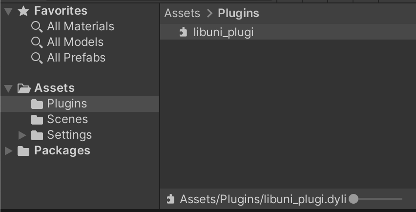
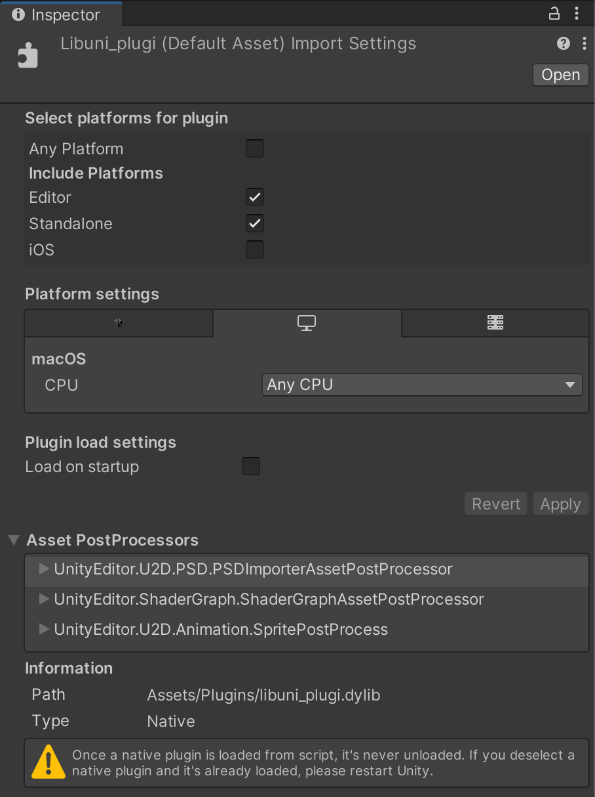
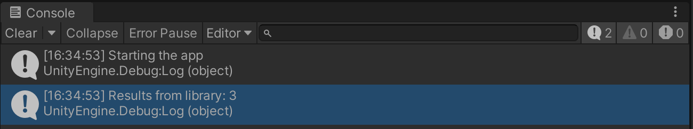

## • Introduction

This article discusses the integration of Rust code into Unity, divided into two main sections:

1.- Setting up the Rust plugin, and

2.- Integrating it into a Unity project

## • First: Rust Plugin Setup

**Create Rust Library Project:** Use Cargo, Rust's package manager, to create a new Rust library project. Here we will create a library called `uni_plugin`.

Open your terminal and execute the following command:

```bash
cargo new uni_plugin --lib
```

**Specify Dynamic System Library Type:** Update the `cargo.toml` file to specify the crate type as cdylib for dynamic system library linkage.

Our Cargo.toml will look like this:

```toml
[package]
name = "uni_plugi"
version = "0.1.0"
edition = "2021"

[lib]
crate-type = ["cdylib"]

[dependencies]

```

**Write Rust Code:** Define the desired functionality in `lib.rs`. Since the purpose of this guide is to test the library integration, we will use the code provided by default.

Peeeero, pero, pero, to properly "export" the functions with the name that we defined (and avoid Rust doing some magic that usually does to avoid naming clashes when linking) we have to use the attribute `#[no_mangle]`.
Failing to do this will result in an `EntryPointNotFoundException` since the method will not be found.

So our *almost by default* code will be something like this:

```rust
#[no_mangle]
pub fn add(left: usize, right: usize) -> usize {
    left + right
}

#[cfg(test)]
mod tests {
    use super::*;

    #[test]
    fn it_works() {
        let result = add(2, 2);
        assert_eq!(result, 4);
    }
}
```

**Build the Library:** Build the Rust library by executing this on the terminal:

```bash
cargo build
```

This will generate the library file in the target/debug directory.
On Windows, the file will have a `.dll` extension, on macOS `.dylib`, and on Linux `.so`.

## • Second: Unity Integration

**Create Plugins Folder:** On your Unity project, create a new folder named `Plugins` inside the Assets directory, then;

**Move/Copy Library File:** Move or copy the generated library file (`libuni_plugin.so/dylib/dll`) into the `Plugins` folder.


##### Plugins folder with our library
---

##### Inspector view of our library
---

**Unity Invocation:** To utilize the functionality provided by the Rust library in Unity, create a C# script.
For example, create a script named `LibraryInvocation.cs` in the `Assets/Scripts` folder.

Attach this script to a GameObject in the scene.
For instance, create an object named `Scripts` and add the script as a new component.

**Here's the important part; How do we execute the code of our Rust library in our C# code?**

**Declare External Function:** In the C# script, declare the external function using the `DllImport` attribute.
Adjust the library name and method signature accordingly. 

Our code looks like this:

```csharp
using System.Runtime.InteropServices;
using UnityEngine;

public class LibraryInvocation : MonoBehaviour
{
#if UNITY_IPHONE
    [DllImport ("__Internal")]
#else
    [DllImport ("Libuni_plugin")]   
#endif
    private static extern uint add(uint left, uint right);
    
    private void Start()
    {
        Debug.Log("Starting the app");
        
        var results = add(1, 2);
        Debug.Log($"Results from library: {results}");
    }
}
```

Now, press play to see the results displayed in the console.



---

## • Notes and Links

Exporting the library to different platforms would depend on the platform itself, [here is an excellent resource](https://rjgameiro.medium.com/let-fun-rust-unity-f7f62609ba49) to go deeper on this.

Source of inspiration: [Creating A DLL With Rust](https://samrambles.com/guides/window-hacking-with-rust/creating-a-dll-with-rust/index.html#hello_runnerexe)

Unity Documentation about plugins: [Native Plugins](https://docs.unity3d.com/Manual/NativePlugins.html)
